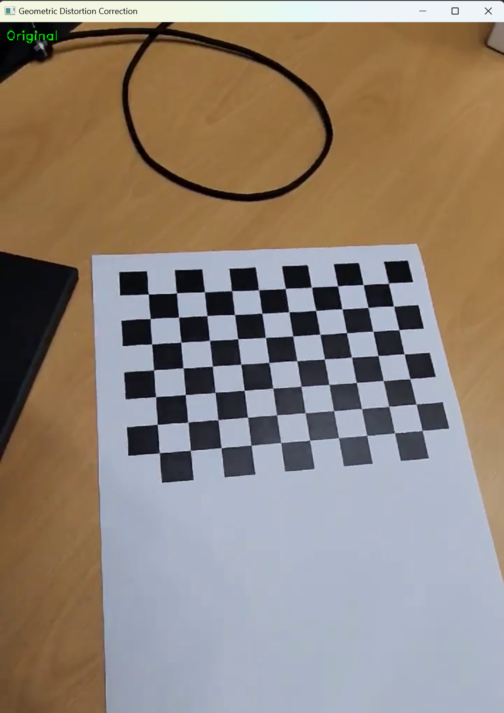
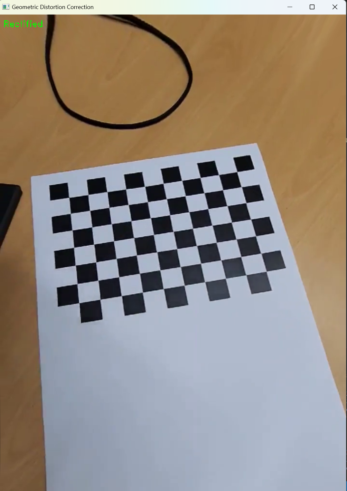

# calibration-and-distortion-correction

This project uses OpenCV to calibrate a video and correct lens distortion.

## Camera Calibration Results

  ### example
    
  
  
  The calibration process uses a set of images to estimate the camera parameters.  
* The number of selected images = 39
* RMS error = 0.468271449869143
* Camera matrix (K) = 
[663.16964366,  0., 356.00677505]  
[0.,    660.4563255,   637.04268857]  
[0, 0, 1]  

* Distortion coefficient (k1, k2, p1, p2, k3, ...) = [ 0.02684667 -0.75258086 -0.00486679  0.00412105  2.70199011]

## Distortion correction
  ### Original VS Distortion correction
  

  
   

